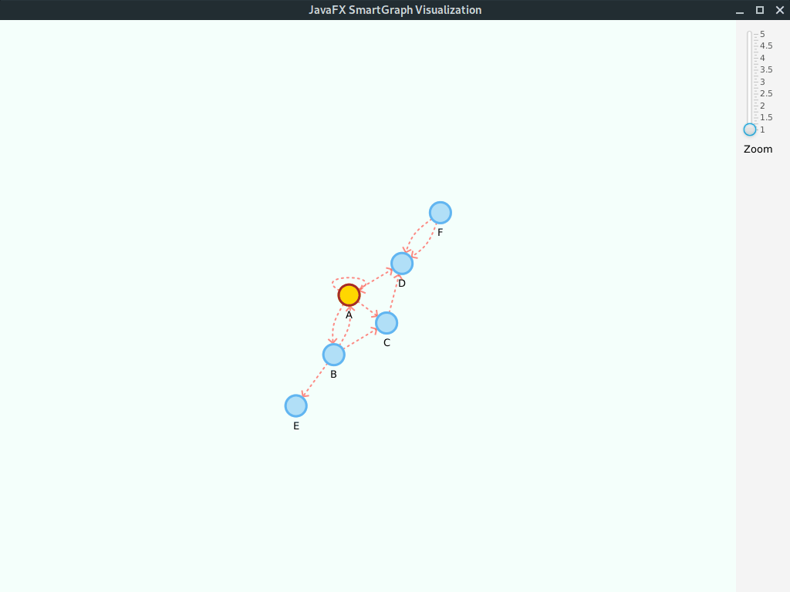
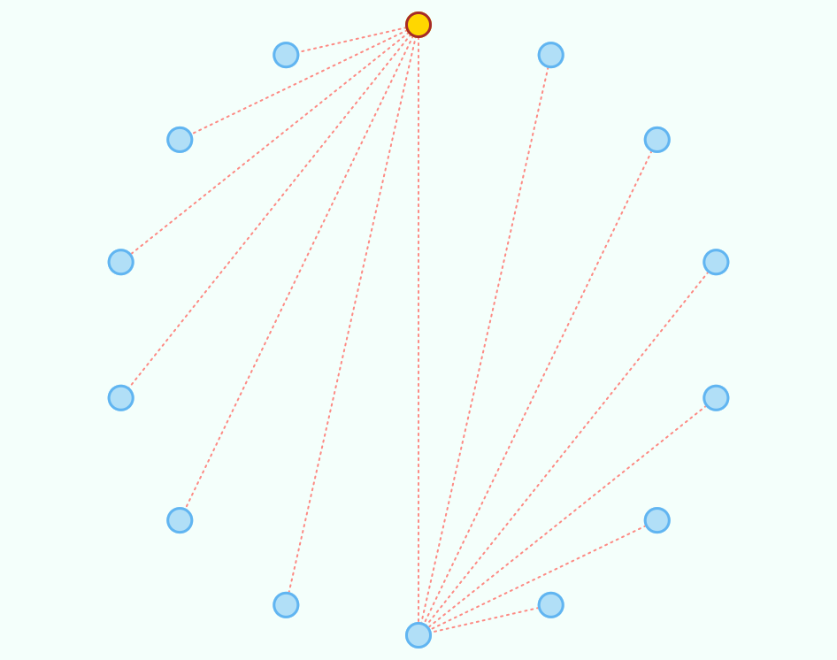
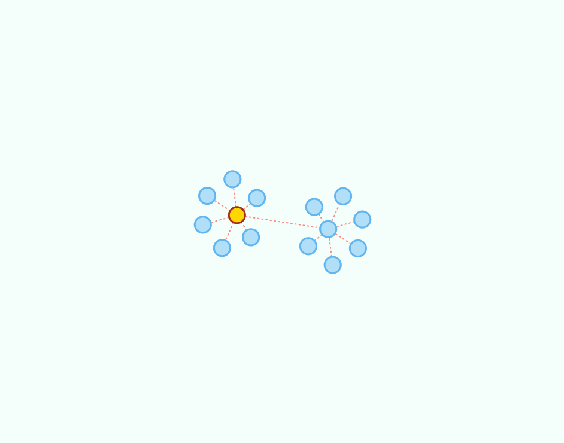
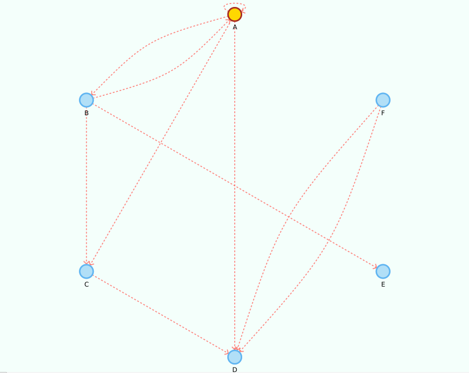

# (JavaFX) SmartGraph

This project provides a generic (Java FX) **graph visualization library** that can automatically arrange the vertices' locations
through a [force-directed algorithm](https://en.wikipedia.org/wiki/Force-directed_graph_drawing) in real-time.

You can, instead, statically place the vertices according to other algorithms.

Vertices and edges can be styled through a *css stylesheet* or programmatically (even at runtime).




### Prerequisites

You need a working JDK with JavaFX libraries to compile/use the library. 

The code was tested with JDK 8 and OpenJDK 11.

### Using the library

Check the `releases` folder for compiled library and source code.

The visualization library can be used together with any ADT that adheres to the `Graph<V,E>` or `Digraph<V,E>` interfaces. Sample implementations are included.

### Accelerated graphics

Since the visualization is computation-intensive during automatic force-directed layout of vertices, you should make sure that the graphics card is used to offload much of the work.

In windows the JVM machine should automatically take care of that, while in Linux you must configure it manually with the `-Dsun.java2d.opengl=True` flag. 

## Getting Started

### Basic usage

```java
//create the graph
Graph<String, String> g = new GraphEdgeList<>();
//... see example below

SmartPlacementStrategy strategy = new SmartCircularSortedPlacementStrategy();
SmartGraphPanel<String, String> graphView = new SmartGraphPanel<>(g, strategy);
Scene scene = new Scene(graphView, 1024, 768);

Stage stage = new Stage(StageStyle.DECORATED);
stage.setTitle("JavaFXGraph Visualization");
stage.setScene(scene);
stage.show();

//IMPORTANT - Called after scene is displayed so we can have width and height values
graphView.init();

```

This will display the graph using the instantiated placement `strategy`. You can create your own by implementing the `SmartPlacementStrategy` *interface*.

### Toggle automatic mode

You can toggle (`true`/`false`) the automatic arrangement of vertices in real-time with:

```java
graphView.setAutomaticLayout(true);
```

or bind the corresponding property to any observable value:

```java
CheckBox automatic = new CheckBox("Automatic layout");
automatic.selectedProperty().bindBidirectional(graphView.automaticLayoutProperty());
```

### Responding to click events on vertices and/or edges

You can attach actions with:

```java
graphView.setVertexDoubleClickAction(graphVertex -> {
    System.out.println("Vertex contains element: " + graphVertex.getUnderlyingVertex().element());
});

graphView.setEdgeDoubleClickAction(graphEdge -> {
    System.out.println("Edge contains element: " + graphEdge.getUnderlyingEdge().element());
    //dynamically change the style, can also be done for a vertex
    graphEdge.setStyle("-fx-stroke: black; -fx-stroke-width: 2;");
});
```

These actions will be performed whenever you click a vertex and/or edge.

### Updating the view

When you make changes to the graph, you can update the visualization by calling

```java
graphView.update();
```

this will add/remove the corresponding vertices and edges from the visualization. If a new vertex is connected to an existing one, it will be initially placed in the vicinity of the later. Otherwise, if it is an *isolated* vertex it will be placed randomly.

### SmartGraph Properties

You can set the graph visualization properties in the `smartgraph.properties` file:

```properties
# Vertex related configurations
#
vertex.allow-user-move = true
vertex.radius = 15 
vertex.tooltip = true
vertex.label = false

# Edge related configurations
#
edge.tooltip = true
edge.label = false
# only makes sense if displaying an oriented graph 
edge.arrow = false

# (automatic) Force-directed layout related configurations
#   -- You should experiment with different values for your 
#   -- particular problem, knowing that not all will achieve 
#   -- a stable state
layout.repulsive-force = 5000
layout.attraction-force = 30
layout.attraction-scale = 10
```

### SmartGraph CSS styling

You can set the default CSS styles in the `smartgraph.css` file:

```css
.graph {
    -fx-background-color: #F4FFFB;    
}

.vertex {
    -fx-stroke-width: 3;
    -fx-stroke: #61B5F1;
    -fx-stroke-type: inside; /* you should keep this for vertex.radius to hold */
    -fx-fill: #B1DFF7;
}

.vertex-label {
    -fx-font: bold 8pt "sans-serif";
}

.edge {
    -fx-stroke-width: 2;
    -fx-stroke: #FF6D66;  
    -fx-stroke-dash-array: 2 5 2 5; /* remove for clean edges */  
    -fx-fill: transparent; /*important for curved edges. do not remove */
    -fx-stroke-line-cap: round;
    -fx-opacity: 0.8;
}

.edge-label {
    -fx-font: normal 5pt "sans-serif";
}

.arrow {
    -fx-stroke-width: 2;
    -fx-stroke: #FF6D66;  
    -fx-opacity: 0.8;
}
```

## Examples

Below are provided some graphs and the corresponding visualization, either using a static placement strategy or by the automatic force-directed layout algorithm.

### Sample Graph

The following code creates a sample graph:

```java
Graph<String, String> g = new GraphEdgeList<>();

g.insertVertex("A");
g.insertVertex("B");
g.insertVertex("C");
g.insertVertex("D");
g.insertVertex("E");
g.insertVertex("F");
g.insertVertex("G");

g.insertEdge("A", "B", "1");
g.insertEdge("A", "C", "2");
g.insertEdge("A", "D", "3");
g.insertEdge("A", "E", "4");
g.insertEdge("A", "F", "5");
g.insertEdge("A", "G", "6");

g.insertVertex("H");
g.insertVertex("I");
g.insertVertex("J");
g.insertVertex("K");
g.insertVertex("L");
g.insertVertex("M");
g.insertVertex("N");

g.insertEdge("H", "I", "7");
g.insertEdge("H", "J", "8");
g.insertEdge("H", "K", "9");
g.insertEdge("H", "L", "10");
g.insertEdge("H", "M", "11");
g.insertEdge("H", "N", "12");

g.insertEdge("A", "H", "0");
```

#### Circular sorted placement (static)



#### Automatic layout



### Sample Digraph (directed graph)

The following code creates a sample digraph:

```java
Digraph<String, String> g = new DigraphEdgeList<>();

g.insertVertex("A");
g.insertVertex("B");
g.insertVertex("C");
g.insertVertex("D");
g.insertVertex("E");
g.insertVertex("F");

g.insertEdge("A", "B", "AB");
g.insertEdge("B", "A", "AB2");
g.insertEdge("A", "C", "AC");
g.insertEdge("A", "D", "AD");
g.insertEdge("B", "C", "BC");
g.insertEdge("C", "D", "CD");
g.insertEdge("B", "E", "BE");
g.insertEdge("F", "D", "DF");
g.insertEdge("F", "D", "DF2");

//yep, its a loop!
g.insertEdge("A", "A", "Loop");
```

Please note that we use the property values `edge.arrow = true` and `vertex.label = true`.

Given its a small graph, we increased the `layout.repulsive-force = 25000`. You should use higher values for smaller graphs; inversely, use smaller values for larger graphs.

#### Circular sorted placement (static)



#### Automatic layout


## Contributing

You can fork this project or submit a pull request. Pull requests should adhere to the existing naming and *Javadoc* conventions.

## Authors

* Original author: **Bruno Silva** - [(GitHub page)](https://github.com/brunomnsilva) | [(Personal page)](https://www.brunomnsilva.com/)

## License

This project is licensed under the MIT License - see the [LICENSE](LICENSE.txt) file for details.


