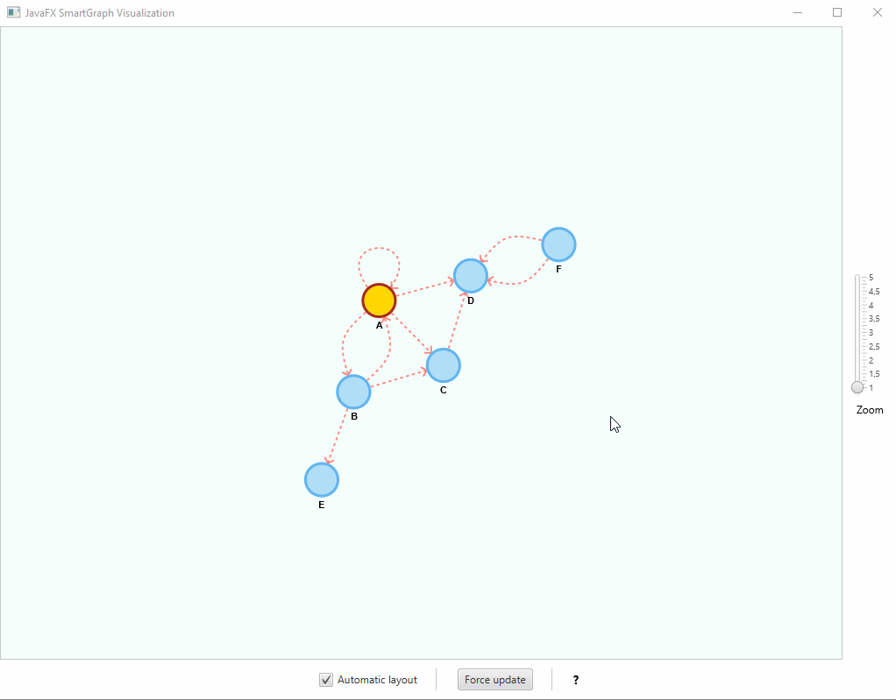
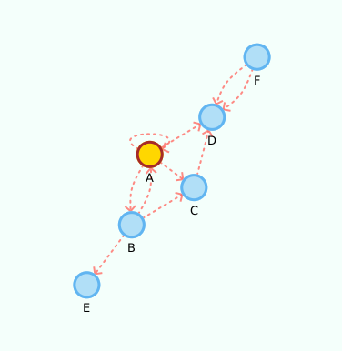

# (JavaFX) SmartGraph

This project provides a generic (Java FX) **graph visualization library** that can automatically arrange the vertices' locations
through a [force-directed algorithm](https://en.wikipedia.org/wiki/Force-directed_graph_drawing) in real-time.



## Features

- The visualization library can be used together with any abstract data type (ADT) that adheres to the `Graph<V,E>` or `Digraph<V,E>` interfaces. Default implementations are included, but you can devise your own;

- Instead of the force-directed automatic layout, vertices can be statically placed according to other algorithms and at *runtime*;

- *Actions* can be performed when clicking the vertices and/or the edges;

- Vertices can be freely moved, if the configuration allows it;

- Can use different shapes to represent vertices;

- The default appearance of vertices and edges are determined by a *properties* and a *css stylesheet* files;

- Can use *annotations* and *providers* to change some properties at runtime, e.g., shape and size of vertices;

- The *styles* can be changed at *runtime* programmatically and based on click events. 

## Documentation

### What's new?

- (2.2.0) Notable changes:

    - ⚠️ Bump minimum JDK to 11 and define library as a Java Module;
    - 👍 Robust algorithm for vertex spawning;
    - Propagation of hover events to labels and arrows (can be styled);
    - 🎉 Improve edge readability (issue #43) by changing the label underlying representation to a StackPane. Labels now accept CSS styles for Pane (background) and Text (the label itself).
    - ⚠️ Fixed a regression that affected the movement of vertices.
    - Other small fixes and improvements.

See the [wiki](https://github.com/brunomnsilva/JavaFXSmartGraph/wiki) for the complete changelist.

### Using the library

Binaries and dependency information for Maven, Gradle and others can be found at [http://search.maven.org](https://central.sonatype.com/search?q=g%3Acom.brunomnsilva++a%3Asmartgraph&smo=true).

Example for Maven, where `x.y.z` is the library version, e.g., `2.2.0`:

```xml
<dependency>
    <groupId>com.brunomnsilva</groupId>
    <artifactId>smartgraph</artifactId>
    <version>x.y.z</version>
</dependency>
```

:warning: Please note that the files `smartgraph.css` and `smartgraph.properties` **must be added manually** to your project.

You can also find in the [releases section](https://github.com/brunomnsilva/JavaFXSmartGraph/releases) the binaries, source code and documentation.

#### Accelerated graphics

Since the visualization is computation-intensive during automatic force-directed layout of vertices, you should make sure that the graphics card is used to offload much of the work. 

In windows the JVM machine should automatically take care of that, while in Linux you must configure it manually with the `-Dsun.java2d.opengl=True` flag.

### Basic usage

```java
// Create the graph
Graph<String, String> g = new GraphEdgeList<>();
// ... see Examples below

SmartPlacementStrategy initialPlacement = new SmartCircularSortedPlacementStrategy();
SmartGraphPanel<String, String> graphView = new SmartGraphPanel<>(g, initialPlacement);
Scene scene = new Scene(graphView, 1024, 768);

Stage stage = new Stage(StageStyle.DECORATED);
stage.setTitle("JavaFXGraph Visualization");
stage.setScene(scene);
stage.show();

//IMPORTANT! - Called after scene is displayed, so we can initialize the graph visualization
graphView.init();
```

This will display the graph using the instantiated placement `strategy`. You can **create your own static placement strategies** by implementing the `SmartPlacementStrategy` *interface* (see included examples).

```java
// Even with a static initial placement of vertices, we can toggle automatic layout
// at any time, e.g.:
graphView.setAutomaticLayout(true);
```

### API Reference

[](https://javadoc.io/doc/com.brunomnsilva/smartgraph)


## Examples

Below are provided some graphs and the corresponding visualization, either using a static placement strategy or by the automatic force-directed layout algorithm.

### Sample Graph

The following code creates a sample graph:

```java
Graph<String, String> g = new GraphEdgeList<>();

g.insertVertex("A");
g.insertVertex("B");
g.insertVertex("C");
g.insertVertex("D");
g.insertVertex("E");
g.insertVertex("F");
g.insertVertex("G");

g.insertEdge("A", "B", "1");
g.insertEdge("A", "C", "2");
g.insertEdge("A", "D", "3");
g.insertEdge("A", "E", "4");
g.insertEdge("A", "F", "5");
g.insertEdge("A", "G", "6");

g.insertVertex("H");
g.insertVertex("I");
g.insertVertex("J");
g.insertVertex("K");
g.insertVertex("L");
g.insertVertex("M");
g.insertVertex("N");

g.insertEdge("H", "I", "7");
g.insertEdge("H", "J", "8");
g.insertEdge("H", "K", "9");
g.insertEdge("H", "L", "10");
g.insertEdge("H", "M", "11");
g.insertEdge("H", "N", "12");

g.insertEdge("A", "H", "0");
```

#### Sample Graph circular sorted placement (static)


#### Sample Graph automatic layout


### Sample Digraph (directed graph)

The following code creates a sample digraph:

```java
Digraph<String, String> g = new DigraphEdgeList<>();

g.insertVertex("A");
g.insertVertex("B");
g.insertVertex("C");
g.insertVertex("D");
g.insertVertex("E");
g.insertVertex("F");

g.insertEdge("A", "B", "AB");
g.insertEdge("B", "A", "AB2");
g.insertEdge("A", "C", "AC");
g.insertEdge("A", "D", "AD");
g.insertEdge("B", "C", "BC");
g.insertEdge("C", "D", "CD");
g.insertEdge("B", "E", "BE");
g.insertEdge("F", "D", "DF");
g.insertEdge("F", "D", "DF2");

//yep, its a loop!
g.insertEdge("A", "A", "Loop");
```

Please note that we use the property values `edge.arrow = true` and `vertex.label = true`.

Given it's a small graph, we increased the `layout.repulsive-force = 25000`. You should use higher values for smaller graphs; inversely, use smaller values for larger graphs.

> See Configuration and Styling section.
> 
#### Sample Digraph circular sorted placement (static)


#### Sample Digraph automatic layout



### Updating the view

When you make changes to the graph, you must update the visualization by calling `SmartGraphPanel#update()` or `SmartGraphPanel#updateAndWait()`. The latter version "blocks" the caller thread until the visualization has updated.

```java
// Any number of changes to the graph
g.removeVertex("A");
//...
        
// Update the visualization
graphView.update();
```

this will add/remove the corresponding vertices and edges from the visualization. If a new vertex is connected to an existing one, it will be initially placed in the vicinity of the latter. Otherwise, if it is an *isolated* vertex it will be placed in the center of the plot.

### Responding to click events on vertices and/or edges

You can attach actions with:

```java
graphView.setVertexDoubleClickAction(graphVertex -> {
    System.out.println("Vertex contains element: " + graphVertex.getUnderlyingVertex().element());
});

graphView.setEdgeDoubleClickAction(graphEdge -> {
    System.out.println("Edge contains element: " + graphEdge.getUnderlyingEdge().element());
    //dynamically change the style, can also be done for a vertex
    graphEdge.setStyleInline("-fx-stroke: black; -fx-stroke-width: 2;");
});
```

These actions will be performed whenever you *double-click* a vertex and/or an edge.

## Configuration and Styling

### SmartGraph Properties

:warning: The `smartgraph.properties` file must exist in you project folder.

You can set the graph visualization properties in the `smartgraph.properties` file:

```properties
# Vertex related configurations
#
vertex.allow-user-move = true
vertex.radius = 15
vertex.shape = circle
vertex.tooltip = true
vertex.label = false

# Edge related configurations
#
edge.tooltip = true
edge.label = false
# only makes sense if displaying an oriented graph 
edge.arrow = false

# (automatic) Force-directed layout related configurations
#
# Notice: deprecated since version 1.1. Force directed layout strategies are now
# instantiated and can be swapped at runtime, per the Strategy design pattern.
# The parameters are passed as arguments or one can use the default ones described
# in the javadoc documentation.
#   -- You should experiment with different values for your 
#   -- particular problem, knowing that not all will achieve 
#   -- a stable state
layout.repulsive-force = 25000
layout.attraction-force = 30
layout.attraction-scale = 10
```

### SmartGraph CSS styling

:warning: The `smartgraph.css` file must exist in you project folder. 
For example, if all your vertices turn out black, this is because this file cannot be found.

You can set the default CSS styles in the `smartgraph.css` file; see below.

The style classes `graph`, `vertex`, `vertex-label`, `edge`, `edge-label` and `arrow` contain the default styling for the nodes and must exist in the file. You can, however, provide different classes to apply to specific elements, e.g., vertices, edges and labels.

The following example contains an additional definition for the CSS class `.myVertex`. You can apply the style individually to an existing element, e.g., vertex, as follows:

```java
graphView.getStylableVertex("A").setStyleClass("myVertex");
```

```css
.graph {
    -fx-background-color: #F4FFFB;
}

.vertex {
    -fx-stroke-width: 3;
    -fx-stroke: #61B5F1;
    -fx-stroke-type: inside; /* you should keep this for vertex.radius to hold */
    -fx-fill: #B1DFF7;
}

.vertex:hover { /* pseudo-classes also work */
    /*-fx-cursor: default; */ /* You can use this style to override the hand/move cursors while hovering. */
    -fx-stroke-width: 4;
}

.vertex-label {
    -fx-font: bold 8pt "sans-serif";
}

.edge {
    -fx-stroke-width: 2;
    -fx-stroke: #FF6D66;  
    -fx-stroke-dash-array: 2 5 2 5; /* remove for clean edges */  
    -fx-fill: transparent; /*important for curved edges. do not remove */
    -fx-stroke-line-cap: round;
    -fx-opacity: 0.8;
}

.edge-label {
    -fx-font: normal 5pt "sans-serif";
}

.arrow {
    -fx-stroke-width: 2;
    -fx-stroke: #FF6D66;  
    -fx-opacity: 0.8;
}

/* Custom vertex. You should revert any unwanted styling in the default element, 
   style, since custom styles will be appended to the default style */
.myVertex {
    -fx-stroke-width: 5;
    -fx-stroke: green;
    -fx-stroke-type: inside; /* you should keep this if using arrows */
    -fx-fill: yellowgreen;
}
```


## Contributing

You can submit a pull request. Pull requests should adhere to the existing naming and *Javadoc* conventions.

## Projects that use this library

- [Word Automata](https://github.com/lorenzodbr/word-automata) - *"... a graphical tool that allows you to create and simulate automata that recognize words. You can add states, transitions, and set the initial and final states. The tool will then allow you to simulate the automaton on a given word, showing you the path that the automaton takes."*

- [PathGraph](https://github.com/vittorioPiotti/PathGraph-JavaFX) - *"Path Graph is a library with all the tools necessary to create and work both path and walk graphs in a stable and simple way."*
  
:star: If you use the library in your project, you can send me a message and I can showcase it in this page.

## License

This project is licensed under the MIT License - see the [LICENSE](LICENSE.txt) file for details. **All derivative work should include this license**.

## Authors

Original author: **Bruno Silva** - [(GitHub page)](https://github.com/brunomnsilva) | [(Personal page)](https://www.brunomnsilva.com/)

---

I hope you find SmartGraph useful and look forward to seeing the projects you create with it!
